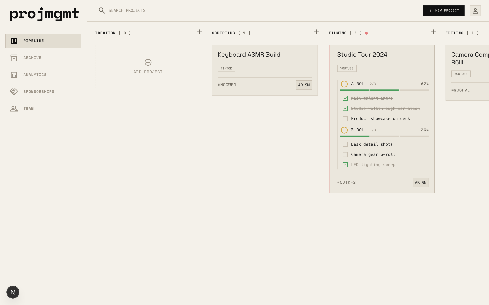
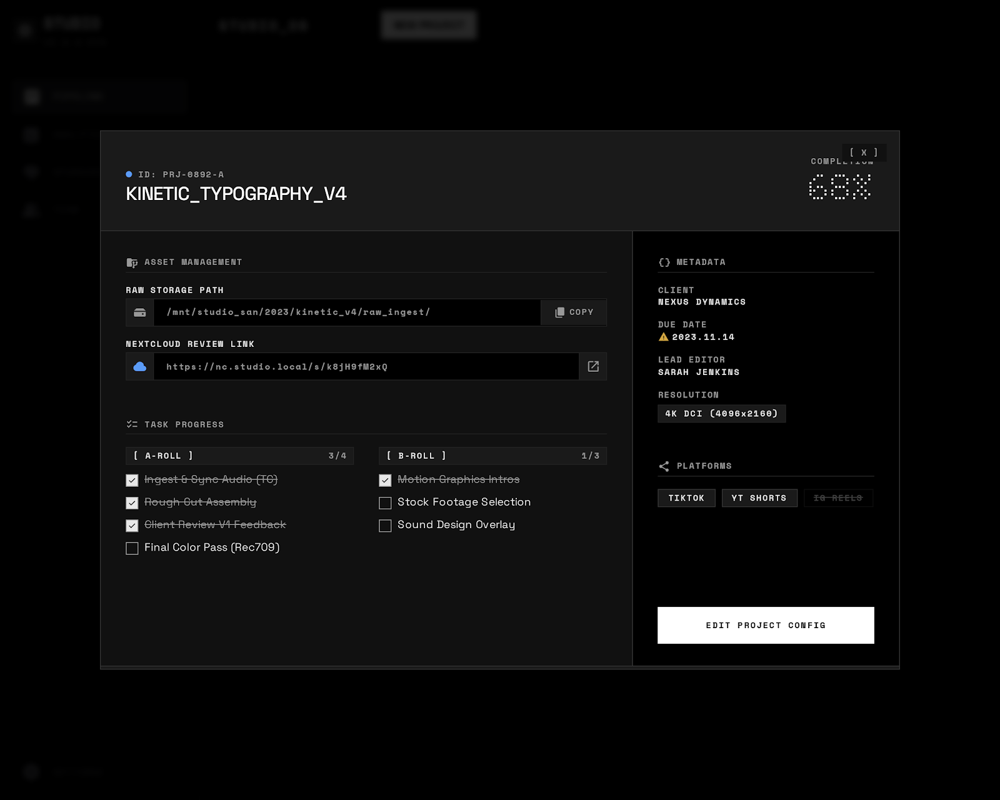
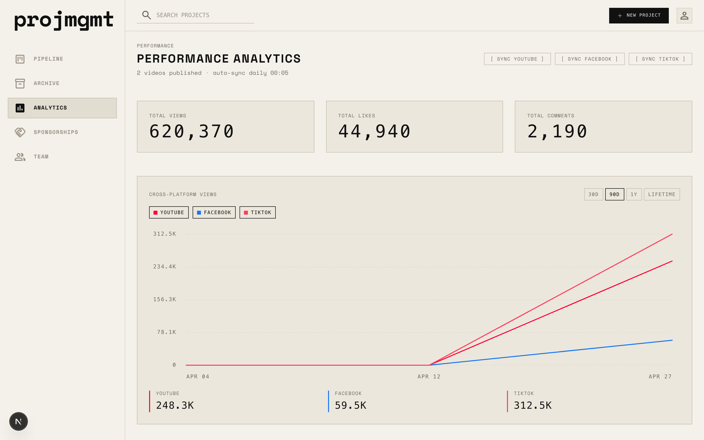
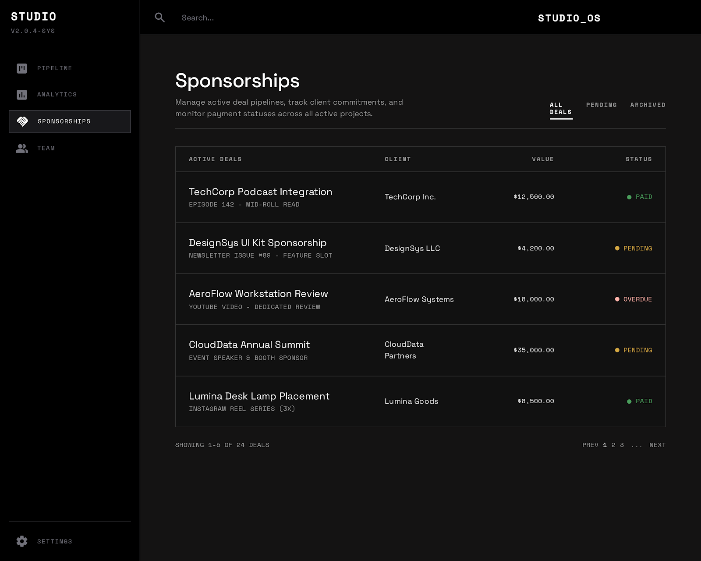
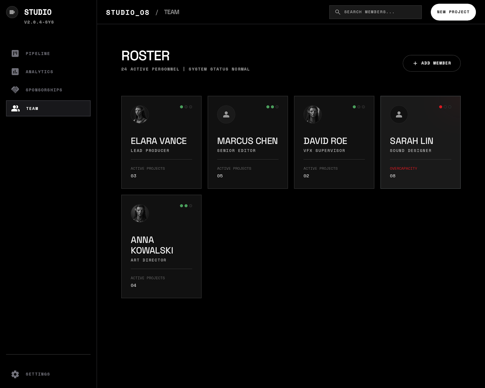
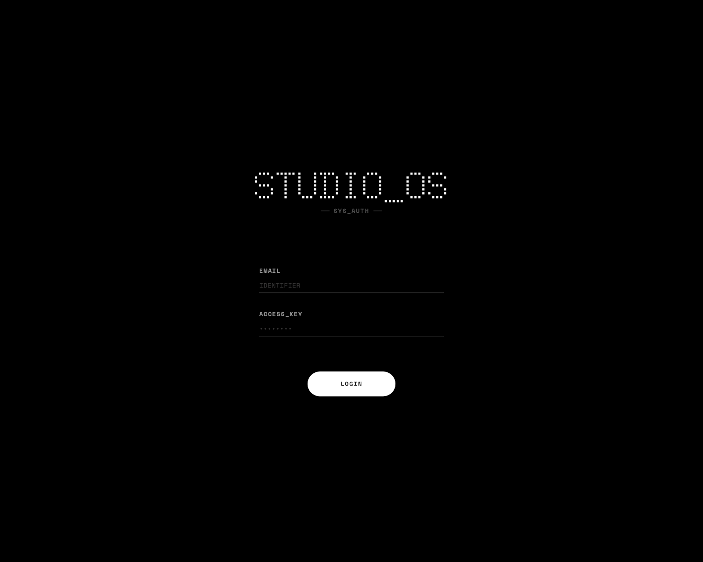
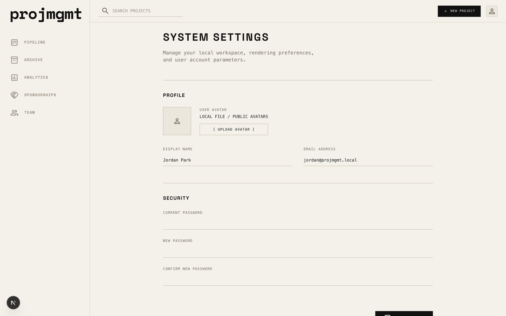
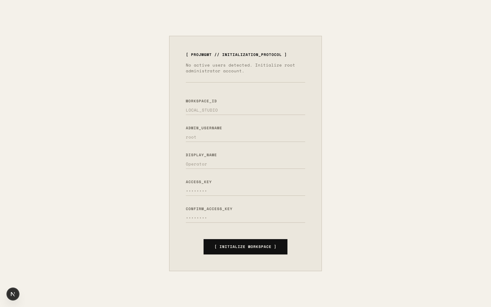

# projmgmt


Self-hosted production management for a small video team: pipeline tracking, filming shotlists, review loops, sponsorships, archive, analytics, and NAS-aware asset paths in a strict terminal-inspired UI.



---

## Overview

projmgmt replaces generic project management tools with a focused workflow for high-bandwidth content teams. It is built around local storage paths, Nextcloud review links, split A-Roll/B-Roll filming checklists, and platform-specific performance tracking.

Core areas:

- **Pipeline** — drag-and-drop Kanban board across `Ideation`, `Scripting`, `Filming`, `Editing`, `Review`.
- **Publishing checklist** — moving to `Published` opens a final metadata modal before the card leaves the board.
- **Archive** — published and scrapped projects live outside the active pipeline.
- **Analytics** — YouTube, Meta, and TikTok metrics are synced and displayed as per-platform totals.
- **Sponsorships** — brand-deal CRM tied to the production workflow.
- **Team** — user roster and role management.
- **Settings** — avatar upload, password change, 2FA.

### Screens

<table>
  <tr>
    <td align="center" width="50%">
      <br />
      <sub><b>Project Details</b> — modal for status, assignees, dates, links</sub>
    </td>
    <td align="center" width="50%">
      <br />
      <sub><b>Analytics</b> — per-platform aggregates</sub>
    </td>
  </tr>
  <tr>
    <td align="center" width="50%">
      <br />
      <sub><b>Sponsorships</b> — brand-deal CRM</sub>
    </td>
    <td align="center" width="50%">
      <br />
      <sub><b>Team</b> — roster and roles</sub>
    </td>
  </tr>
  <tr>
    <td align="center" width="50%">
      <br />
      <sub><b>Login</b> — terminal-style auth</sub>
    </td>
    <td align="center" width="50%">
      <br />
      <sub><b>Settings</b> — profile, security, 2FA</sub>
    </td>
  </tr>
</table>

---

## Workflow Rules

- `Filming -> Editing` requires all parsed `aRollShots` and `bRollShots` to be complete.
- `Editing -> Review` requires a Nextcloud review link.
- Review rejection returns the project to `Editing` and stores feedback on the card.
- Published projects move out of `/pipeline` and into `/archive`.
- Archive and Analytics totals are computed from platform-specific columns:
  - `youtubeViews`, `metaViews`, `tiktokViews`
  - `youtubeLikes`, `metaLikes`, `tiktokLikes`
  - `youtubeComments`, `metaComments`, `tiktokComments`

### Roles

- `ADMIN` — full access.
- `MANAGER` — full operational access.
- `MEMBER` — limited; blocked from `/analytics`, `/sponsorships`, and `/team`.

---

## Deployment

Designed for a local or self-hosted environment with SQLite and optional access to NAS, Nextcloud, and platform analytics APIs. Two supported paths:

- **Bare-metal Node.js** (`npm run dev` / `npm run build && npm run start`) — see [Local Setup](#local-setup).
- **Docker Compose / GHCR image** — see [Docker](#docker).

Both paths land on the same first-run wizard the moment the database is empty, so no manual user provisioning is ever required.

### Local Setup

#### 1. Prerequisites

- Node.js 20 or newer.
- npm (bundled with Node).
- A local `.env` file (template below).

#### 2. Install

```bash
git clone https://github.com/neyako/projmgmt.git
cd projmgmt
npm install
```

`npm install` runs `prisma generate` through the `postinstall` script.

#### 3. Configure `.env`

Create `.env` in the project root:

```bash
DATABASE_URL="file:./dev.db"

NEXTAUTH_URL="http://localhost:3000"
NEXTAUTH_SECRET="replace-with-a-generated-secret"

NEXT_PUBLIC_NAS_IP="192.168.1.10"
NEXT_PUBLIC_NAS_SHARE="projects"
NEXT_PUBLIC_NAS_ROOT_DIR="Studio"
```

Generate a local auth secret:

```bash
openssl rand -base64 32
```

Optional integration variables:

```bash
YOUTUBE_API_KEY=""
META_ACCESS_TOKEN=""
TIKTOK_RAPIDAPI_HOST=""
TIKTOK_RAPIDAPI_KEY=""

NEXTCLOUD_URL=""
NEXTCLOUD_USER=""
NEXTCLOUD_PASSWORD=""
```

#### 4. Initialize SQLite

```bash
npm run db:push
```

Produces a fresh `prisma/dev.db` with no users. The first-run wizard handles admin creation in step 6 — no manual bcrypt scripting required.

#### 5. Run

```bash
npm run dev
```

Open `http://localhost:3000`.

#### 6. First-Run Initialization Wizard



On a fresh database (`userCount === 0`), every route — including `/login` and `/` — redirects to `/setup`. The wizard captures:

- `WORKSPACE_ID` — display label for the studio (e.g. `Local Studio`)
- `ADMIN_USERNAME` — login identifier (e.g. `admin`, `root`)
- `DISPLAY_NAME` — name shown in UI assignments
- `ACCESS_KEY` + `CONFIRM_ACCESS_KEY` — password, minimum 8 characters

Submitting `[ INITIALIZE WORKSPACE ]` runs `initializeStudio` (`src/app/setup/actions.ts`), which:

1. Re-checks `prisma.user.count()` server-side. Any value `> 0` throws `"Studio already initialized."` — this prevents anyone from hitting `/setup` later to create a rogue admin.
2. Hashes the password with `bcrypt` (10 rounds).
3. Creates the user with `role: "ADMIN"` and a synthetic email of `${username}@local` (the schema requires a unique email; edit it later from `/settings` if you want a real address).
4. Redirects to `/login` for the first sign-in.

Once one user exists, `/setup` becomes inert and bounces back to `/login`.

#### 7. Optional Sample Data

To load demo people and projects:

```bash
npm run db:seed
```

`npm run db:seed` is **destructive**: it deletes every existing `User`, `Project`, `ShotlistItem`, and `Analytics` row before inserting demo records.

The seed and the wizard do not compose:

- The seed wipes any admin the wizard created.
- The seed populates users without passwords, so `userCount > 0` blocks the wizard *and* nobody can sign in.

If you want demo content with a working login, run `npm run db:seed`, open `npm run db:studio`, and set a `passwordHash` on one demo user (use `bcrypt.hash(...)` from a one-liner). For a clean self-hosted deployment, skip the seed entirely and let the wizard create the first user.

#### 8. Verify A Local Build

```bash
npm run build
```

There are currently no configured `lint` or `test` scripts.

### Docker

The production image uses Next.js standalone output, Node.js 22, Prisma, and a persistent SQLite volume. It runs `prisma db push --skip-generate` on container start by default so the mounted SQLite database matches `prisma/schema.prisma`.

#### Local Compose

Create a Docker env file from the example and set a real auth secret:

```bash
cp .env.example .env
openssl rand -base64 32
```

Set `NEXTAUTH_SECRET` in `.env`, then run:

```bash
docker compose up --build
```

Open `http://localhost:3000`. On a fresh `projmgmt-data` volume the database is empty, so the first request lands on the [first-run wizard](#6-first-run-initialization-wizard) and you create the root admin from the browser — no `docker exec` bcrypt scripting required.

Compose stores SQLite data in the `projmgmt-data` volume at `/app/data/projmgmt.db` and uploaded avatars in the `projmgmt-avatars` volume. The container fixes those mounted directory permissions on startup before running Prisma as the unprivileged app user. Set `PRISMA_DB_PUSH=false` only if you want to manage schema updates yourself.

#### GHCR Image

Images are published to:

```bash
ghcr.io/neyako/projmgmt
```

Pull and run the latest default-branch image:

```bash
docker pull ghcr.io/neyako/projmgmt:latest
docker compose up
```

`NEXT_PUBLIC_NAS_IP`, `NEXT_PUBLIC_NAS_SHARE`, and `NEXT_PUBLIC_NAS_ROOT_DIR` are baked into the client bundle by Next.js. For GitHub-built images, set those as repository variables before the workflow runs, or rebuild locally with Docker Compose build args.

### CI/CD

GitHub Actions workflow: `.github/workflows/docker-ghcr.yml`.

Triggers: pushes to `main`, `master`, `codex/**`, tags matching `v*.*.*`, pull requests into `main`/`master`, and manual dispatch.

- `verify` installs dependencies, prepares a temporary SQLite schema, and runs `npm run build`.
- `docker` builds the image with Buildx, pushes branch/tag/SHA tags to GHCR on non-PR events, and marks `latest` only for the default branch.

Uses the built-in `GITHUB_TOKEN` with `packages: write`; no registry PAT needed.

---

## Daily Development

```bash
npm run dev       # Next.js dev server with Turbopack
npm run build     # production build verification
npm run start     # run the built app
npm run db:push   # push Prisma schema to SQLite
npm run db:seed   # destructive sample data reset
npm run db:studio # inspect/edit SQLite data
```

Main local paths:

- `src/app/` — App Router pages, layouts, API routes, global CSS, and app-level actions.
- `src/actions/` — primary Server Actions for database mutations.
- `src/components/` — layout, Kanban, modal, table, analytics, sponsorship, team, UI components.
- `src/lib/` — auth, roles, Prisma client, constants, helpers.
- `src/services/` — cron and external analytics service helpers.
- `src/types/` — shared types layered on Prisma models.
- `src/utils/nasPaths.ts` — OS-aware SMB path generation.
- `prisma/schema.prisma` — SQLite schema.
- `prisma/seed.ts` — destructive demo data seed.
- `DESIGN.md` — visual source of truth.
- `AGENTS.md` — AI assistant and contributor guardrails.

## Design Contract

The UI is intentionally terminal-inspired and high contrast. Preserve it.

- Use semantic Tailwind theme tokens from `src/app/globals.css`.
- Follow `DESIGN.md`.
- Do not introduce generic rounded corporate UI.
- Do not add raw Tailwind palette colors such as `red-500`, `green-400`, or `emerald-500`.
- Standard list/table pages use `h-full w-full overflow-auto p-lg`.
- Keep visible controls sharp, uppercase, compact, and mono-heavy.

## Data Notes

Several fields are JSON strings in SQLite and must be parsed/stringified by the UI and Server Actions:

- `platformsTargeted`
- `aRollShots`
- `bRollShots`
- `abTitles`
- `thumbnails`

`folderName` is the source of truth for local media location. RAW paths are generated from `NEXT_PUBLIC_NAS_IP`, `NEXT_PUBLIC_NAS_SHARE`, and `NEXT_PUBLIC_NAS_ROOT_DIR`; do not hardcode SMB roots in components.

## License

MIT. See [LICENSE](LICENSE).
