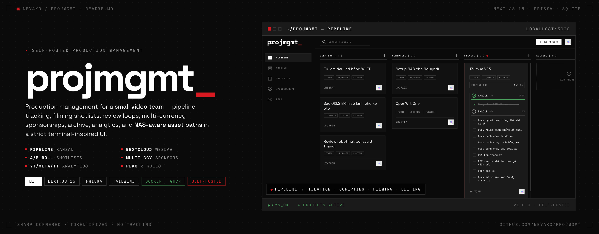
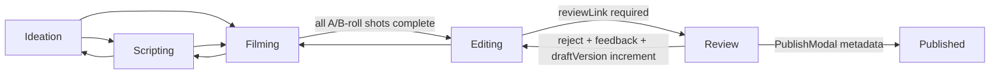

<p align="center">
  <a href="public/README%20Header.html">
    
  </a>
</p>

<h1 align="center">projmgmt</h1>

<p align="center">
  Self-hosted content production management for a small video team.
  <br />
  Pipeline tracking, filming shotlists, review loops, sponsorship CRM, analytics, and NAS-aware asset paths in one sharp terminal UI.
</p>

<p align="center">
  
  
  
  
  
  
</p>

<p align="center">
  <a href="#quick-start">Quick Start</a>
  ·
  <a href="#screens">Screens</a>
  ·
  <a href="#workflow-contract">Workflow</a>
  ·
  <a href="#configuration">Configuration</a>
  ·
  <a href="#docker">Docker</a>
  ·
  <a href="#development">Development</a>
</p>

---

## Overview

`projmgmt` replaces generic project-management tooling with an opinionated dashboard for a content studio that needs local storage discipline, review-version control, sponsor context, and platform analytics without giving up self-hosting.

It is built for teams that move video projects through idea, script, shoot, edit, review, publish, and archive with hard workflow gates instead of loose status labels.

<table>
  <tr>
    <td width="33%"><b>Pipeline</b><br /><sub>Drag-and-drop Kanban across Ideation, Scripting, Filming, Editing, Review, and Published.</sub></td>
    <td width="33%"><b>Shotlists</b><br /><sub>A-Roll and B-Roll checklists gate Filming to Editing transitions.</sub></td>
    <td width="33%"><b>Review Loop</b><br /><sub>Nextcloud draft scanning, version-aware review links, rejection feedback, and resubmission state.</sub></td>
  </tr>
  <tr>
    <td width="33%"><b>Sponsorships</b><br /><sub>Brand-deal CRM with linked projects, source currencies, preferred-currency totals, and briefing snapshots.</sub></td>
    <td width="33%"><b>Analytics</b><br /><sub>YouTube, Meta, and TikTok metrics tracked in platform-specific columns.</sub></td>
    <td width="33%"><b>Asset Paths</b><br /><sub>NAS path generation from project folder names, runtime NAS config, and publish/archive state.</sub></td>
  </tr>
</table>

## Screens


<table>
  <tr>
    <td align="center" width="50%">
      
      <br />
      <sub><b>Project Details</b> — status, assignees, dates, shotlists, links, sponsorship context.</sub>
    </td>
    <td align="center" width="50%">
      
      <br />
      <sub><b>Analytics</b> — platform-aware totals and top performers.</sub>
    </td>
  </tr>
  <tr>
    <td align="center" width="50%">
      
      <br />
      <sub><b>Sponsorships</b> — deal value, currency conversion, status, due dates, linked project counts.</sub>
    </td>
    <td align="center" width="50%">
      
      <br />
      <sub><b>Team</b> — user roster and role management.</sub>
    </td>
  </tr>
  <tr>
    <td align="center" width="50%">
      
      <br />
      <sub><b>Setup</b> — first-run admin creation when the database is empty.</sub>
    </td>
    <td align="center" width="50%">
      
      <br />
      <sub><b>Settings</b> — avatar, password, language, and preferred currency.</sub>
    </td>
  </tr>
</table>

## Quick Start

Requires Node.js 22 and npm.

```bash
git clone https://github.com/neyako/projmgmt.git
cd projmgmt
npm install
cp .env.example .env
```

Edit `.env`, then initialize SQLite and start the app:

```bash
npm run db:push
npm run dev
```

Open `http://localhost:3000`. If the database has no users, the app redirects to `/setup` and asks for the first admin account.

### First-Run Setup

The setup wizard captures:

| Field | Purpose |
| --- | --- |
| `WORKSPACE_ID` | Studio display label, such as `Local Studio`. |
| `ADMIN_USERNAME` | Login identifier for the root admin. |
| `DISPLAY_NAME` | Name shown in assignments and UI chrome. |
| `ACCESS_KEY` | Password, minimum 8 characters. |

Submitting `[ INITIALIZE WORKSPACE ]` calls `src/app/setup/actions.ts`, re-checks `prisma.user.count()`, creates an `ADMIN`, and then sends you to `/login`. Once any user exists, `/setup` redirects back to `/login`.

### Demo Data

```bash
npm run db:seed
```

The seed is destructive: it deletes existing `User`, `Project`, `ShotlistItem`, and `Analytics` rows before inserting sample records.

The seed and setup wizard do not compose cleanly. The seed wipes the wizard-created admin and creates users without passwords, so a seeded database needs a manual `passwordHash` set through `npm run db:studio` before anyone can sign in. For real self-hosting, skip the seed and use `/setup`.

## Configuration

Minimum local `.env`:

```bash
DATABASE_URL="file:./dev.db"

NEXTAUTH_URL="http://localhost:3000"
NEXTAUTH_SECRET="replace-with-a-generated-secret"

NEXT_PUBLIC_NAS_IP="192.168.1.10"
NEXT_PUBLIC_NAS_SHARE="projects"
NEXT_PUBLIC_NAS_ROOT_DIR="Studio"

# Runtime aliases preferred by server-generated NAS path display.
NAS_IP=""
NAS_SHARE=""
NAS_ROOT_DIR=""
```

Generate an auth secret:

```bash
openssl rand -base64 32
```

Optional integrations:

```bash
YOUTUBE_API_KEY=""
META_ACCESS_TOKEN=""
TIKTOK_RAPIDAPI_HOST=""
TIKTOK_RAPIDAPI_KEY=""

NEXTCLOUD_URL=""
NEXTCLOUD_USER=""
NEXTCLOUD_PASSWORD=""
NEXTCLOUD_BASE_PATH="/Studio_Projects"
NEXTCLOUD_ARCHIVE_PATH="/Done"
```

| Variable | Used For |
| --- | --- |
| `DATABASE_URL` | Prisma SQLite connection. |
| `NEXTAUTH_URL`, `NEXTAUTH_SECRET` | NextAuth credentials sessions. |
| `NAS_IP`, `NAS_SHARE`, `NAS_ROOT_DIR` | Runtime NAS path display, preferred for Docker/self-hosting. |
| `NEXT_PUBLIC_NAS_*` | Public build-time NAS fallbacks. |
| `NEXTCLOUD_*` | WebDAV folder provisioning, draft scanning, review links, archive movement. |
| `YOUTUBE_API_KEY` | YouTube Data API sync. |
| `META_ACCESS_TOKEN` | Meta Graph API sync. |
| `TIKTOK_RAPIDAPI_*` | TikTok RapidAPI sync. |

Currency conversion uses the no-key [ExchangeRate-API Open Access](https://www.exchangerate-api.com/docs/free) endpoint. Rates are cached in SQLite, warmed on server start, refreshed daily by cron, and attributed on the Sponsorships page.

## Workflow Contract



Operational rules:

| Area | Rule |
| --- | --- |
| Pipeline | `/pipeline` excludes `Published` and `Scrapped`; `/archive` shows them. |
| Publishing | Moving to `Published` is intercepted by `PublishModal` for final metadata. |
| Shotlists | `Filming -> Editing` requires every parsed `aRollShots` and `bRollShots` item to be complete. |
| Review | `Editing -> Review` requires `reviewLink`; rejection clears it and increments `draftVersion`. |
| Nextcloud | Draft scanning looks for `draft {draftVersion} - {project folder name}` case-insensitively and stores an internal file link. |
| Sponsorships | Sponsored projects must link to an `Active` or `Pending` `Sponsorship` through `Project.sponsorshipId`. |
| Analytics | Archive and Analytics totals come from platform-specific metric columns, not legacy rollup fields. |
| Localization | Pipeline deadline months and modal date labels follow the active app locale. |

Roles:

| Role | Access |
| --- | --- |
| `ADMIN` | Full access, including team and role management. |
| `MANAGER` | Full operational access. |
| `MEMBER` | Blocked from `/analytics`, `/sponsorships`, and `/team`. |

## Docker

The production image uses Next.js standalone output, Node.js 22, Prisma, and a persistent SQLite volume. The entrypoint runs `prisma db push --skip-generate` by default so the mounted database tracks `prisma/schema.prisma`.

```bash
cp .env.example .env
openssl rand -base64 32
docker compose up --build
```

Set `NEXTAUTH_SECRET` in `.env` before starting Docker.

Compose stores:

| Volume | Path | Contents |
| --- | --- | --- |
| `projmgmt-data` | `/app/data/projmgmt.db` | SQLite database. |
| `projmgmt-avatars` | `/app/public/avatars` | Uploaded avatars. |

Pull the published image:

```bash
docker pull ghcr.io/neyako/projmgmt:latest
docker compose up
```

For NAS path generation in Docker, prefer `NAS_IP`, `NAS_SHARE`, and `NAS_ROOT_DIR`; they work at runtime without rebuilding. `NEXT_PUBLIC_NAS_*` values remain public build-time fallbacks and can be set as GitHub repository variables for GHCR builds.

## Development

```bash
npm run dev       # Next.js dev server with Turbopack
npm run build     # production build verification
npm run start     # run the built app
npm run db:push   # push Prisma schema to SQLite
npm run db:seed   # destructive sample data reset
npm run db:studio # inspect/edit SQLite data
```

There are currently no configured `lint` or `test` scripts. `npm run build` is the main verification command.

### Project Map

| Path | Purpose |
| --- | --- |
| `src/app/` | App Router pages, layouts, API routes, global CSS, app-level actions. |
| `src/app/setup/` | First-run initialization wizard. |
| `src/actions/` | Primary Server Actions for mutations. |
| `src/components/kanban/` | Pipeline board, cards, columns, shotlist UI, review controls. |
| `src/components/modals/` | Project, publish, sponsorship, team, and stats modal workflows. |
| `src/components/layout/` | Persistent shell, sidebar, top bar. |
| `src/components/ui/` | Small terminal-style UI primitives. |
| `src/lib/` | Auth, Prisma, constants, roles, currency, i18n, Nextcloud service code. |
| `src/services/` | Cron, currency refresh scheduling, external platform helpers. |
| `src/utils/nasPaths.ts` | OS-aware SMB path generation. |
| `prisma/schema.prisma` | SQLite schema; several array-like fields are JSON strings by design. |
| `DESIGN.md` | Visual design source of truth. |
| `AGENTS.md` | AI assistant and contributor operating guide. |

## Data Notes

SQLite stores these fields as JSON strings. Parse on read and stringify before mutations:

| Field | Shape |
| --- | --- |
| `platformsTargeted` | `string[]` |
| `aRollShots`, `bRollShots` | `{ id: string; text: string; isCompleted: boolean }[]` |
| `abTitles`, `thumbnails` | `string[]` |

Important persistence rules:

| Rule | Why |
| --- | --- |
| `folderName` is the source of truth for local media location. | RAW paths are generated from NAS env vars and project state. |
| `storagePath` is legacy/secondary. | Do not hardcode SMB roots in components. |
| `Sponsorship.budget` and `Sponsorship.currency` store the source amount. | Converted preferred-currency values are display-only. |
| `CurrencyRate` stores supported pair rates generated from USD upstream data. | Sponsorship totals convert at read/render time. |
| Platform-specific analytics columns are authoritative. | `youtube*`, `meta*`, and `tiktok*` power Archive and Analytics totals. |

## Design Contract

The UI is intentionally terminal-inspired, high contrast, sharp, and token-driven.

Follow [DESIGN.md](DESIGN.md) before changing UI. In short:

| Do | Avoid |
| --- | --- |
| Use semantic Tailwind theme tokens from `src/app/globals.css`. | Raw palette classes like `red-500`, `green-400`, `emerald-500`. |
| Keep labels compact, uppercase, mono-heavy. | Generic corporate UI copy and soft decorative cards. |
| Use sharp borders, visible dividers, and existing `.ui-*` utilities. | Rounded cards, shadows, blur-heavy surfaces, scale-hover effects. |
| Preserve `p-lg` list/table page containers. | New `p-8` page shells. |

## CI/CD

GitHub Actions workflow: `.github/workflows/docker-ghcr.yml`.

| Job | Behavior |
| --- | --- |
| `verify` | Installs dependencies and runs `npm run build`. |
| `docker` | Builds with Buildx, pushes branch/tag/SHA tags to GHCR on non-PR events, marks `latest` only for the default branch. |

Triggers: pushes to `main`, `master`, `codex/**`, tags matching `v*.*.*`, pull requests into `main`/`master`, and manual dispatch.

## License

MIT. See [LICENSE](LICENSE).
